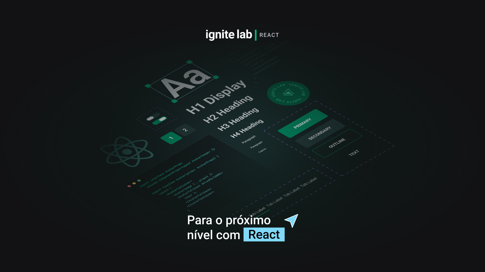
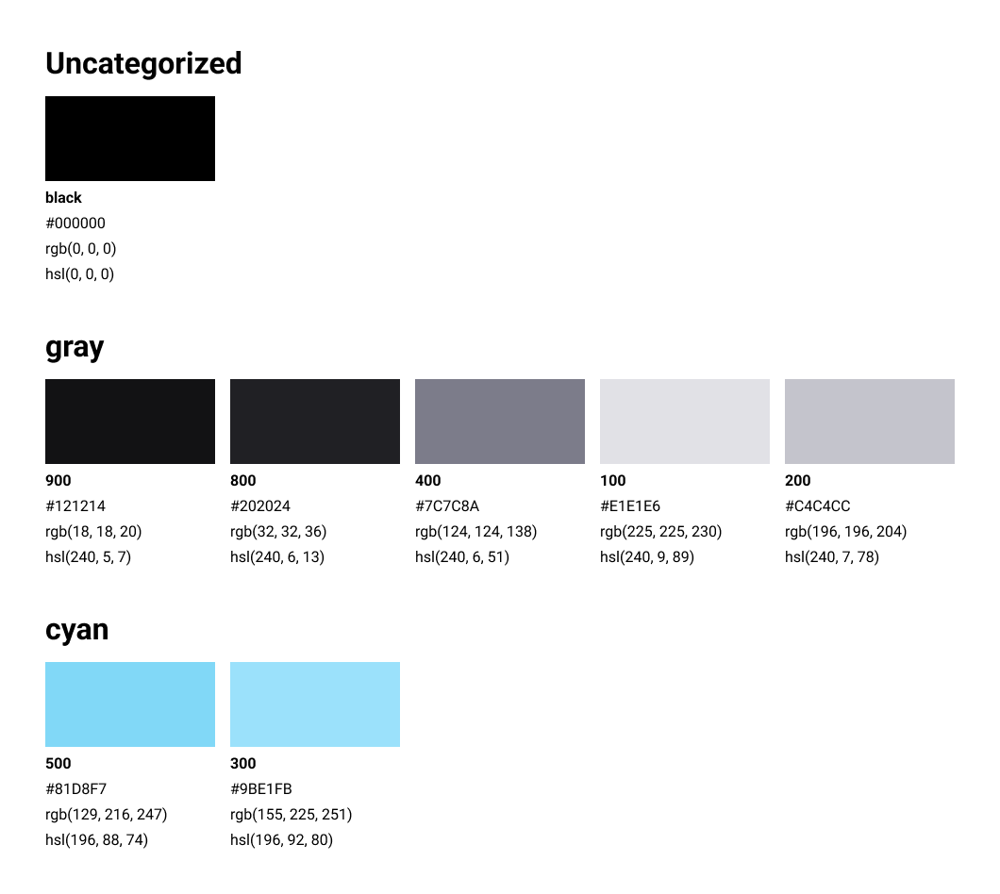
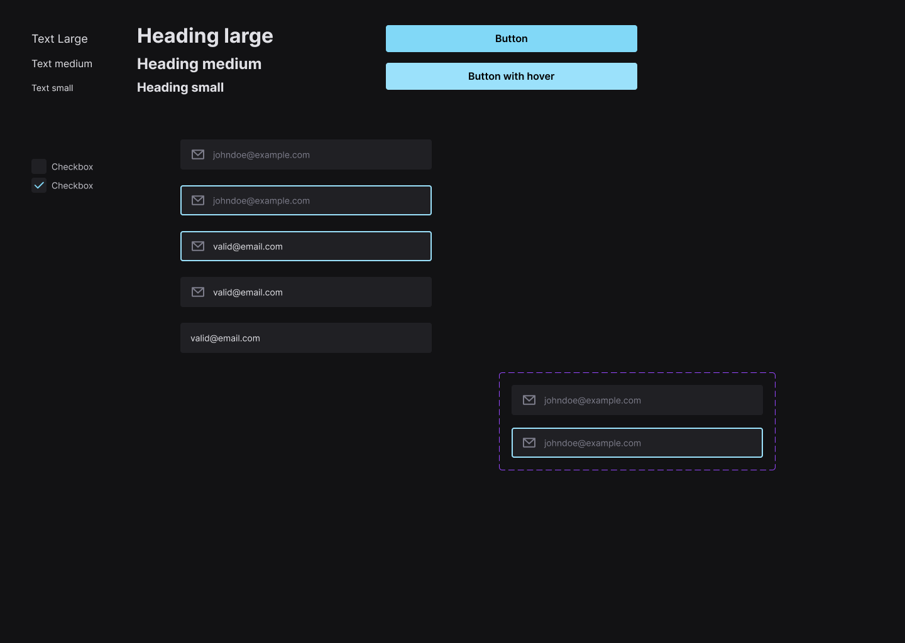
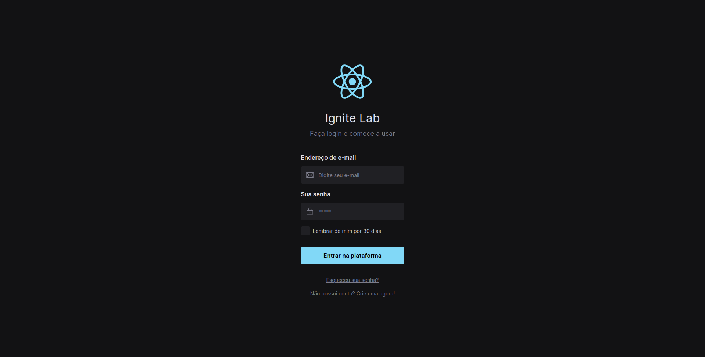
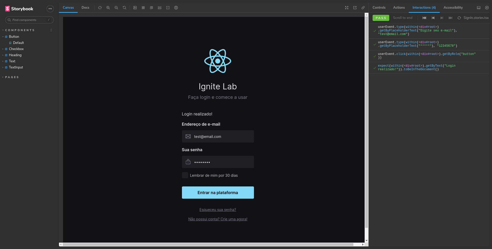

<p align="center">
  
  <br>
</p>
<h3 align="center">
  A complete design system made with React.
</h3>

<br><br>

<p align="center">
  
  
  
  
</p>
<br>

<p align="center">
  <a href="#sobre">Sobre</a> •
  <a href="#design-system">Design System</a> •
  <a href="#instalação">Instalação</a> •
  <a href="#tecnologias">Tecnologias</a> •
  <a href="#autor">Autor</a>  
</p>

<br>

## Sobre

Projeto desenvolvido durante o Ignite Lab 04 de React, evento criado pela RocketSeat. Um evento 100% online e GRATUITO, com conteúdo exclusivo e INÉDITO.

Ocorreu do dia 10 ao dia 12 de outubro de 2022 e teve como intuito mostrar na prática como construir um design system completo utilizando o melhor que o mercado tem no momento. Dentre as ferramentas utilizadas temos React, Figma, Radix, Jest e Storybook. O resultado pode ser confiro logo abaixo juntamente com o arquivo do Figma construído durante o evento.



## Design System

O foco desse projeto é criar um design system para padronizar as interfaces de uma aplicação, documentar seus componentes e deixar explicito cores, tipografia e quais componentes estão disponíveis para uso.

Iniciamos a construção do nosso design system definindo os tokens de cores que nossa aplicação iria necessitar. Após a definição, utilizamos um plugin do Figma para gerar a página abaixo para, de forma visual, ilustrar quais cores constituem o tema da aplicação e seus respectivos códigos de cores e seus pesos:



Com as cores definidas, partimos para os componentes da aplicação, aonde definimos quais seriam os campos existentes e os elementos tipográficos das nossas páginas. O resultado pode ser visto abaixo na página do Figma criada para idealizar nossos componentes:



Com nossas cores e componentes definidos, criamos uma tela de login para sentir na pele os benefícios de possuir um design system e a facilidade que essa ferramenta nos traz na hora de construir interfaces para nossa aplicação. Para o exemplo criamos a tela abaixo utilizando os tokens e componentes que criamos anteriormente:



O design system criado está disponível [nesse arquivo do Figma](https://www.figma.com/file/sELnRf8oFBBnsD7etobIlL/Ignite-Lab-04---React?node-id=0%3A1&t=7lIN60WFFuMiuWfK-1). Lá estão disponíveis todos os tokens, fontes, componentes e tela de exemplo construída utilizando 100% nosso design system.

Todos nossos componentes também foram documentados através do Storybook, contendo todas suas variações e dando a flexibilidade para os desenvolvedores testarem os resultados e comportamento sem escrever uma linha de código. Além dos componentes também implementamos um pequeno teste na nossa página de login, teste esse que é executado dentro do próprio Storybook, conforme painel exibido na parte direita na imagem abaixo:



## Instalação

Antes de começar, você vai precisar ter instalado em sua máquina as seguintes ferramentas:
[Git](https://git-scm.com), [Node.js](https://nodejs.org/en/).
Além disto é bom ter um editor para trabalhar com o código como [VSCode](https://code.visualstudio.com/).

### 🖥️ Rodando o Front End (Web)

```bash
# Clone este repositório
$ git clone git@github.com:MrRioja/lab-design-system.git

# Acesse a pasta do projeto no terminal/cmd
$ cd lab-design-system

# Instale as dependências
$ npm install
# Caso prefira usar o Yarn execute o comando abaixo
$ yarn

# Execute a aplicação em modo de desenvolvimento
$ npm run dev
# Caso prefira usar o Yarn execute o comando abaixo
$ yarn dev

# Execute o Storybook para visualizar os componentes e páginas
$ npm run storybook
# Caso prefira usar o Yarn execute o comando abaixo
$ yarn storybook

# O servidor inciará na porta 3000 - acesse <http://localhost:3000>
```

## Tecnologias


<br><br><br><br>

## Autor

<div align="center">

<h1>Luiz Rioja</h1>
<strong>Backend Developer</strong>
<br/>
<br/>

<a href="https://linkedin.com/in/luizrioja" target="_blank">

</a>

<a href="https://github.com/mrrioja" target="_blank">

</a>

<a href="mailto:lulyrioja@gmail.com?subject=Fala%20Dev" target="_blank">

</a>

<a href="https://api.whatsapp.com/send?phone=5511933572652" target="_blank">

</a>

<a href="https://join.skype.com/invite/tvBbOq03j5Uu" target="_blank">

</a>

<br/>
<br/>
</div>
